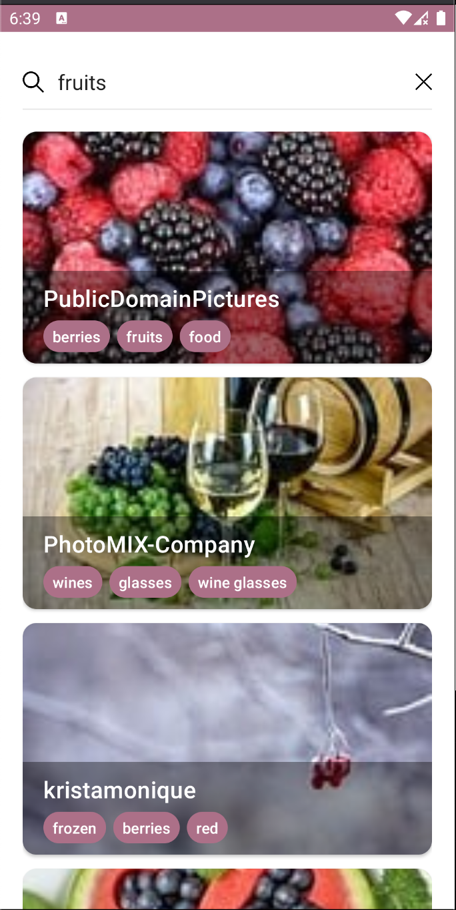

## ReviewImagesApp sample
ReviewImagesApp is a sample app of reviewing and searching images, built in Kotlin.
* Clean Architecture
* MVVM design architecture pattern with UseCases
* SOLID, KISS, DRY (design architecture principles)
* Entity and Model layers to safely parse data from API

### Features
* View list of images on the home page
* View current image, tags, number of likes, comments and downloads
* Search for images
* More to be added :)

### Libraries and Dependencies
AndroidX:
* Paging 3
* Navigation
* Room (simple caching)

Other:
* <a href= "https://square.github.io/retrofit/">Retrofit</a> for network requests
* <a href="https://github.com/Kotlin/kotlinx.serialization">kotlinx.serialization</a> for parsing JSON data
* <a href="https://square.github.io/okhttp/">OkHttp</a>
* <a href="https://github.com/bumptech/glide">Glide</a>
* <a href="https://github.com/googlecodelabs/android-hilt">Hilt</a> for DI

### Todo:
* Jetpack Compose UI
* Redesign of the app
* Github Actions for CI/CD
* Splash screen

### Screenshots



## License

```
Copyright 2021 The Android Open Source Project

Licensed under the Apache License, Version 2.0 (the "License");
you may not use this file except in compliance with the License.
You may obtain a copy of the License at

    https://www.apache.org/licenses/LICENSE-2.0

Unless required by applicable law or agreed to in writing, software
distributed under the License is distributed on an "AS IS" BASIS,
WITHOUT WARRANTIES OR CONDITIONS OF ANY KIND, either express or implied.
See the License for the specific language governing permissions and
limitations under the License.
```